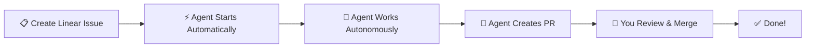

# Linear + Symphony: The Golden Rule

> The simplest possible guide to using Symphony with Linear. Read this FIRST.

---

## The 30-Second Version



**That's it.** Capture the issue → Move it to `Todo` when ready → Agent works → You merge.

---

## Minimal Example: "Add Dark Mode Toggle"

### 1. Create the Linear Issue

Go to Linear and create an issue in your configured project. If your team uses `Triage`, start there and move to `Todo` when the issue is implementation-ready:

```
Title: Add dark mode toggle to header

Description:
Add a dark mode toggle button to the top-right corner of the header.
- Should be a moon/sun icon
- Clicking it should switch between light and dark theme
- Should persist user preference in localStorage
- Should apply theme immediately without page refresh

State: Triage or Todo
Project: Creative Playground
```

**Hit Enter.** If the issue was created in `Triage`, move it to `Todo`. Now watch.

---

### 2. What Happens (Automatically)

**Within 30 seconds:**

```
[10:00:00] You create issue → CRE-42 created
[10:00:10] You move issue from Triage → Todo
[10:00:15] Symphony detects new "Todo" issue
[10:00:18] Agent starts, creates workspace
[10:00:20] Issue state changes: 📋 Todo → ⚡ In Progress
[10:00:25] Agent posts plan to Linear workpad
```

**Linear workpad shows:**

```
🤖 Agent Started

## Task Breakdown
- [ ] Create dark mode toggle component
- [ ] Add moon/sun icon assets
- [ ] Implement theme switching logic
- [ ] Add localStorage persistence
- [ ] Update header component
- [ ] Test theme switching

## Environment
- Workspace: v0-ipod/CRE-42
- Branch: feature/dark-mode-toggle
- Repository: ipod-shuffle

Starting work...
```

**Next 5-15 minutes:** Agent works autonomously.

```
[10:02] ✅ Created toggle component
[10:04] ✅ Added icon assets
[10:06] ✅ Implemented theme switching
[10:08] ✅ Added localStorage persistence
[10:10] ✅ Updated header component
[10:12] ✅ Tests passing
[10:15] Agent creates PR #123
```

**Agent's final comment:**

```
✅ Task Complete

Created PR: https://github.com/s3nik/ipod-shuffle/pull/123

## Changes
- Added dark mode toggle to header
- Moon/sun icon switches based on theme
- Preference persists in localStorage
- Theme applies instantly without reload
- All existing tests passing

Ready for review!
```

**Issue state changes:** ⚡ In Progress → 👀 Human Review

---

### 3. You Review and Merge

**In Linear:**
- Click the PR link in attachments
- Review the code changes on GitHub
- Merge the PR

**In Linear:**
- Change issue state to ✅ Done

**That's the complete workflow.**

---

## The Golden Rules

### Rule 1: Be Specific in Issue Descriptions

**Good:**
```
Add a search bar to the navigation with autocomplete.
- Should search across posts, tags, and users
- Show results as you type (debounced)
- Use existing design system components
```

**Not Good:**
```
Add search
```

**Why?** More detail = Better agent understanding = Better results.

---

### Rule 2: Use "Todo" State to Trigger Agent

Symphony only picks up issues in **"Todo"** state.

- ✅ **Triage** → Intake inbox, agent does not start yet
- ✅ **Todo** → Agent starts automatically
- ❌ **Backlog** → Agent ignores it
- ❌ **In Progress** (manual) → Agent ignores it

**Use Triage for capture and Todo for execution.**

---

### Rule 3: Check Linear Workpad for Agent's Plan

The agent posts its plan to the Linear workpad within 30 seconds of starting.

**Review the plan to:**
- See what the agent will do
- Verify it understood the requirements
- Add clarifications if needed (agent will see them)

**If the plan looks wrong, you can:**
- Add a comment with corrections
- Or cancel the issue (set to "Cancelled")

---

### Rule 4: Review PR Before Merging

Agents create PRs automatically, but **YOU** decide when to merge.

**Before merging:**
- Review the code changes
- Check tests are passing
- Verify it matches requirements

**Don't blindly auto-merge.** Agents are good but not perfect.

---

## Issue State Reference

| State | Emoji | Meaning | What to Do |
|-------|-------|---------|------------|
| **Triage** | 🧭 | New intake, still being categorized | Refine it, then move to `Todo` when ready |
| **Todo** | 📋 | Waiting for agent to start | Nothing - agent will pick it up automatically |
| **In Progress** | ⚡ | Agent actively working | Watch progress in Linear workpad |
| **Human Review** | 👀 | PR ready for your review | Review and merge the PR |
| **Done** | ✅ | Completed and merged | Celebrate! |

---

## Common Patterns

### Pattern 1: Quick Fix

```
Title: Fix typo on homepage
Description: Change "recieve" to "receive" on homepage hero text
State: Triage or Todo
```

Agent will:
1. Find the typo
2. Fix it
3. Create PR
4. ~5 minutes total

---

### Pattern 2: New Component

```
Title: Create reusable Button component
Description:
Create a Button component with the following props:
- variant: 'primary' | 'secondary' | 'ghost'
- size: 'sm' | 'md' | 'lg'
- loading: boolean
- disabled: boolean

Follow existing design system patterns.
```

Agent will:
1. Create component file
2. Implement variants and sizes
3. Add TypeScript types
4. Write tests
5. Create PR
6. ~15-20 minutes total

---

### Pattern 3: Feature Implementation

```
Title: Add user profile page

Description:
Create a user profile page with the following sections:
- Avatar (editable)
- Bio (editable)
- Social links (editable)
- Recent activity (read-only)

Should be accessible at /profile/:username
Should fetch data from /api/users/:id
Should allow editing if current user = profile owner
```

Agent will:
1. Create page component
2. Implement all sections
3. Add API integration
4. Add edit mode with auth check
5. Add routing
6. Write tests
7. Create PR
8. ~30-45 minutes total

---

## Troubleshooting Quick Tips

### "Agent hasn't started after 2 minutes"

**Check:**
- Is issue in "Todo" state? (Not Backlog, not In Progress)
- Is issue in the configured project? (Check `projects.yml`)
- Is Symphony running? (`./launch.sh status`)

---

### "Agent's plan doesn't match what I wanted"

**Fix:**
- Add a clarifying comment to the Linear issue
- Agent will see it and adjust
- Or cancel the issue and create a new one with clearer requirements

---

### "No PR was created"

**Check:**
- Read the workpad comments - agent may have hit a blocker
- Check logs: `tail -f logs/v0-ipod.log`
- Agent may still be working (be patient)

---

### "PR has bugs"

**Fix:**
- Review the PR and request changes (GitHub review)
- Or manually fix and commit to the same branch
- Or close PR and create new Linear issue with bug details

---

## Quick Start Commands

```bash
# Check Symphony is running
./launch.sh status

# Start Symphony (if not running)
./launch.sh start all

# Monitor a specific Linear issue
./watch-linear.sh CRE-42

# Launch full monitoring dashboard
./watch-demo.sh

# Open Phoenix web dashboard
open http://localhost:4001
```

---

## Next Steps

**After reading this guide:**

1. ✅ Create your first Linear issue (use the "Dark Mode Toggle" example above)
2. ✅ Watch it in Linear workpad or with `./watch-linear.sh ISSUE-ID`
3. ✅ Review the PR when ready
4. ✅ Merge and mark Done

**For more details:**
- **[LINEAR-WORKFLOW.md](LINEAR-WORKFLOW.md)** - Complete workflow guide
- **[SETUP.md](SETUP.md)** - Installation and setup
- **[MONITORING-README.md](MONITORING-README.md)** - Monitoring tools reference

---

**Remember:** Create issue → Agent works → You merge. That's it. 🎯
