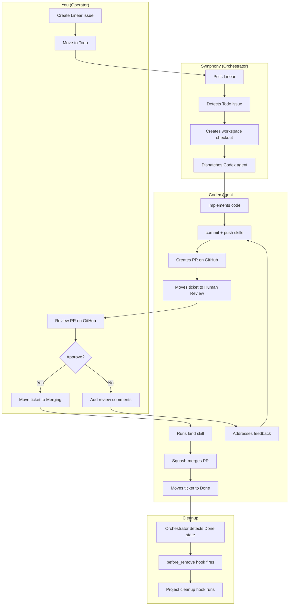

# Symphony Operations Guide

The operator's playbook for running Symphony autonomous agents end-to-end: from Linear issue to merged PR to cleaned-up workspace.

---

## How It All Fits Together



---

## The Operator Workflow

This is the repeatable loop you run for every batch of agent work.

### 1. Start

```bash
cd ~/Desktop/symphony-hub
./launch.sh intake --project mymind-clone-web --prompt "Raw request here"   # Optional diagnosis-first Triage draft
./launch.sh start mymind-clone-web     # Start orchestrator + dashboard
```

If you are starting from a raw request instead of a ready Linear issue, use
`./launch.sh intake` first. It writes a local intake bundle, diagnoses the repo
against current `origin/main`, calls out likely auth/restriction surfaces, and
only creates a Linear issue if you pass `--apply`.

### 2. Monitor

Pick your preferred surface:

| Method | Command / URL |
|--------|---------------|
| Web dashboard (real-time) | `open http://localhost:4002` |
| TUI terminal dashboard | `./launch.sh --tui` |
| Startup or resume brief | `./launch.sh brief` |
| Queue hygiene audit | `./launch.sh audit` |
| Diagnosis-first intake draft | `./launch.sh intake --project mymind-clone-web --prompt "..."` |
| Source topology | `./launch.sh sources` |
| Save resumable checkpoint | `./launch.sh checkpoint pre-review` |
| Tail logs | `tail -f ~/Desktop/open-ai-symphony/symphony/elixir/log/symphony.log` |
| JSON API — full state | `curl http://localhost:4002/api/v1/state` |
| JSON API — single issue | `curl http://localhost:4002/api/v1/CRE-6` |
| JSON API — force poll | `curl -X POST http://localhost:4002/api/v1/refresh` |

### 3. Review

Agents create PRs automatically and move the Linear ticket to **Human Review**.

- Go to the PR on GitHub (link is in the Linear ticket and dashboard)
- Review the diff, run the app locally if needed:
  ```bash
  cd ~/Desktop/symphony-hub/workspaces/mymind-clone-web/CRE-6
  cat PROGRESS.md                    # What the agent did
  git diff origin/main --stat        # Summary of changes
  bun install && bun run dev         # Start dev server at localhost:3000
  ```
- **Approve** → move ticket to `Merging`
- **Request changes** → add review comments on the PR; the agent picks them up and pushes a new revision

### Review Surfaces

Keep these code locations distinct:

- **Current active generation**: `~/Desktop/symphony-hub/workspaces/<project>/<ISSUE>`
- **Canonical landed code**: the configured project `repo_root`, for example `~/Desktop/mymind-clone-web`
- **Past unreviewed or abandoned generations**: `~/Desktop/symphony-setup/workspaces/<project>/<ISSUE>`

Use them like this:

- If a ticket has an active PR, review the PR first and use the current
  `symphony-hub/workspaces/...` directory for local verification.
- If the work is already merged, the canonical source is the product repo
  `repo_root`.
- If the ticket was archived or never reached a PR, inspect the preserved
  generation in `symphony-setup/workspaces/...` with `./launch.sh recover`.

This keeps review simple:
- GitHub PR = review artifact
- `symphony-hub/workspaces` = live execution artifact
- product repo root = shipped code
- `symphony-setup/workspaces` = legacy evidence artifact

### 4. Land

Once you move the ticket to **Merging**, the agent automatically:
1. Runs the `land` skill
2. Squash-merges the PR
3. Moves the ticket to **Done**

**Batch landing**: If you have many PRs ready, move them all to `Merging` at once — agents handle the rest sequentially.

### 5. Cleanup

When a ticket hits **Done**, the orchestrator automatically:
1. Fires the `before_remove` hook
2. Cleans up the workspace according to the project's configured strategy
3. For worktree projects, removes the worktree and prunes stale refs

No manual cleanup required.

---

## When Things Go Wrong

### Agent didn't push or create a PR

Go to the workspace and do it manually:

```bash
cd ~/Desktop/symphony-hub/workspaces/mymind-clone-web/CRE-6
git add -A
git commit -m "feat(tags): implement tag prioritization

Closes CRE-6"
git push origin feature/CRE-6
gh pr create --base main --head feature/CRE-6 \
  --title "feat(tags): implement tag prioritization"
```

### Merge conflicts between agent branches

When multiple agents work on overlapping code, land PRs sequentially:

1. Pick the most independent PR first and merge it
2. The next agent's `land` skill will auto-rebase before merging
3. If rebase fails, go to the workspace and resolve manually:
   ```bash
   cd ~/Desktop/symphony-hub/workspaces/mymind-clone-web/CRE-8
   git fetch origin main
   git rebase origin/main
   # resolve conflicts
   git push --force-with-lease origin feature/CRE-8
   ```

### Stale workspaces

If workspaces linger after tickets are Done:

```bash
cd ~/Desktop/mymind-clone-web
git worktree list                    # See all worktrees
git worktree remove ~/Desktop/symphony-hub/workspaces/mymind-clone-web/CRE-6
git worktree prune                   # Clean up stale references
```

### Queue cleanup

Before starting a new batch, audit the configured projects:

```bash
cd ~/Desktop/symphony-hub
./launch.sh audit
./launch.sh audit --project mymind-clone-web --stale-hours 12
./linear-archive.sh --issue CRE-8 --workspace-root ~/Desktop/symphony-setup/workspaces/mymind-clone-web
./launch.sh recover --project mymind-clone-web --root ~/Desktop/symphony-setup/workspaces --issue CRE-8
```

Use the report to:
- move half-baked requests back to `Triage` or an archived/non-executing state
- spot `Human Review` or `Merging` issues missing PR attachments
- find active tickets without a `Codex Workpad`
- identify stale `Todo`, `In Progress`, and `Rework` tickets

The intake compiler is bounded on purpose:
- it attempts a richer Codex-backed spec compile first
- if that does not complete quickly enough, it falls back to a deterministic diagnosis draft instead of hanging the operator loop

Preservation-first rule:
- do not delete workflow tickets to make the board look clean
- remove them from active views by state, not by erasing history
- leave a short note when archiving, superseding, or splitting work
- preserve PR links, validation evidence, and workpad history for future audits

If a stale ticket only has local runtime evidence left, use `linear-archive.sh`
to add the archive note and move it out of the active queue without losing the
workspace path or issue history.

If you need to inspect preserved legacy workspaces before deciding whether to
revive or supersede a ticket, use `./launch.sh recover` against
`symphony-setup/workspaces`.

### Diagnosis-first intake

When the work starts as a natural-language request instead of a clean issue,
use:

```bash
cd ~/Desktop/symphony-hub
./launch.sh intake --project mymind-clone-web --prompt "Raw task request"
./launch.sh intake --project mymind-clone-web --prompt-file ./notes/task.md --apply
```

This is the right place for the system to be autonomous:

- raw request in
- repo diagnosis against current `origin/main`
- code evidence and LOC out
- auth / restriction hints out
- structured `Triage` draft out

This is intentionally not the execution trigger. `Todo` remains the execution
gate after the issue body is tightened.

If the issue already exists and you want to catch it up to the current repo
state instead of creating a new one, target it directly:

```bash
./launch.sh intake --project mymind-clone-web --issue CRE-123 --prompt "Updated task wording"
```

That updates the managed intake block but preserves the rest of the issue body.

### Changing spec mid-flight

Use the smallest possible intervention that preserves a single coherent task:

- Before `Todo`: edit the issue directly. It is still intake.
- In `In Progress`: small clarifications should be added as one explicit Linear comment with a `SPEC UPDATE` header.
- In `In Progress`: if the change alters architecture, acceptance criteria, or scope meaningfully, move the ticket back out of execution, rewrite it, and then re-queue it.
- In `Human Review`: implementation corrections belong in PR review comments. Net-new scope should become a follow-up issue.

This keeps the run stable:
- Linear issue = execution truth
- single `## Codex Workpad` comment = progress truth
- local checkpoint = operator handoff truth

Avoid rewriting the task in five different places. One issue, one workpad, one coherent PR is the clean path.

If the current run is no longer the right path, archive or supersede it cleanly instead of deleting it. That keeps the system resumable and auditable.

### Checkpoints and handoff

Before a risky refactor, before review, or before handing work to another agent, save a local checkpoint:

```bash
cd ~/Desktop/symphony-hub
./launch.sh sources
./launch.sh checkpoint pre-review
```

This writes a timestamped snapshot under `checkpoints/` with:
- current `symphony-hub` git state
- current engine fork/upstream reference and git state
- launcher status, workspace inventory, and recent log tails
- Linear queue audit output when API access is available

Treat checkpoints as local persistence for operator context. They are not the source of truth for issue execution; Linear workpads still own per-issue progress.

### Agent errors

1. Check the log: `tail -100 ~/Desktop/open-ai-symphony/symphony/elixir/log/symphony.log`
2. Check the dashboard for error badges at `http://localhost:4002`
3. Retry by moving the ticket back to **Todo** in Linear — Symphony re-detects and restarts

---

## Three-Repo Relationship

```
symphony-hub (github.com/stussysenik/symphony-hub)
  Role: Operator interface — TUI, launch scripts, workflow configs, project definitions
  Language: Go + Shell
  Key files: launch.sh, projects.yml, workflows/*.md
        |
        | launches
        v
open-ai-symphony (github.com/stussysenik/symphony)
  Role: Core engine — orchestrator, dashboard, Codex client, workspace management
  Language: Elixir/OTP
  Fork of: github.com/openai/symphony
  Key files: orchestrator.ex, app_server.ex, agent_runner.ex, event_log.ex
        |
        | creates worktrees in
        v
mymind-clone-web (github.com/stussysenik/mymind-clone-web)
  Role: Product repo — agent PRs land here
  Language: TypeScript (Next.js)
  Runtime workspace: ~/Desktop/symphony-hub/workspaces/mymind-clone-web/
```

### Configuration note

`projects.yml` is the source of truth for runtime paths and workspace behavior:

- `workspace_root` defines where per-issue workspaces live.
- `repo_root` points at the canonical local checkout for a project.
- `workspace_strategy` chooses `clone` or `worktree` per project.
- `engine.*` records the local fork and upstream OpenAI Symphony reference.
- `workflow_appendix` appends project-specific workflow notes without forking the shared template.

After changing any of those fields, regenerate the workflow files with `./generate-workflows.sh`.

---

## Versioning & Tagging

Going forward, `symphony-hub` should use semantic-release for progressive
versioning and GitHub releases. Historical `beta/*` tags remain part of the
repo history, but new automated releases use semver `v*` tags.

| Repo | Tag format | Example |
|------|-----------|---------|
| symphony-hub | `v{major}.{minor}.{patch}` | `v0.2.0` |
| open-ai-symphony | `custom/{feature}-v{n}` | `custom/dashboard-v1` |
| mymind-clone-web | `v{major}.{minor}.{patch}` | `v0.5.0` |

### symphony-hub

```bash
cd ~/Desktop/symphony-hub
npm ci
npm run release:dry-run
# Automated releases run from GitHub Actions on push to main/next/beta/alpha
```

### open-ai-symphony (fork management)

You have `origin` (your fork) and `upstream` (OpenAI):

```bash
cd ~/Desktop/open-ai-symphony/symphony

# Push your changes
git push origin main

# Sync from upstream periodically
git fetch upstream
git merge upstream/main

# Tag your customizations
git tag -a custom/dashboard-v1 -m "Dashboard revamp with event stream"
git push origin main --tags
```

### mymind-clone-web

```bash
cd ~/Desktop/mymind-clone-web
# After squash-merging all agent PRs:
git pull origin main
git tag -a v0.5.0 -m "CRE-6, CRE-8, CRE-11 agent work"
git push origin main --tags
```

---

## CLI Reference

### launch.sh

```bash
./launch.sh start <project>          # Start orchestrator + dashboard
./launch.sh stop <project>           # Stop gracefully
./launch.sh health                   # Check if running
./launch.sh brief                    # Startup/resume summary
./launch.sh resume                   # Alias for brief
./launch.sh --tui                    # Start with TUI monitor
./launch.sh tui                      # Launch TUI standalone
./launch.sh status                   # Show running instances
```

### API Endpoints (localhost:4002)

| Endpoint | Method | Description |
|----------|--------|-------------|
| `/api/v1/state` | GET | Full orchestrator state |
| `/api/v1/<issue-id>` | GET | Single issue detail |
| `/api/v1/refresh` | POST | Force Linear poll |

### Monitoring Scripts

```bash
./watch-demo.sh                      # 4-pane tmux dashboard
./watch-linear.sh CRE-5              # Watch specific Linear issue
./watch-workspace.sh <project-name>  # Watch the most active issue workspace for a project
./watch-events.sh <project-name>     # Watch agent event stream
./linear-audit.sh                    # Audit queue hygiene across configured Linear projects
./linear-new.sh                      # Open pre-filled Linear issue composer
```

### Agent Workspace Inspection

```bash
cd ~/Desktop/symphony-hub/workspaces/mymind-clone-web/CRE-6
cat PROGRESS.md                      # Agent's progress notes
cat LEARNING.md                      # Agent's learning notes
git diff origin/main --stat          # Summary of changes
git diff origin/main                 # Full diff
ls pr-screenshots/                   # Visual artifacts
```

---

## What You Can See About Agent Reasoning

### Available today

| Data | Where | How to access |
|------|-------|---------------|
| Event stream | EventLog GenServer (in-memory) | Dashboard at `localhost:4002` |
| Last codex message per issue | Orchestrator snapshot | Dashboard running sessions |
| Token usage (input/output/total) | Orchestrator snapshot | Dashboard metric cards |
| Token delta per event | EventLog metadata | Dashboard event stream `+Nt` badges |
| Rate limits | Orchestrator snapshot | Dashboard rate limits section |
| Disk logs + ingestion summaries | `log/symphony.log` (rotating, 50MB) | `tail -f` or read directly |
| Agent's git diff | Workspace on disk | `git diff origin/main` in workspace |
| Progress notes | `PROGRESS.md` in each workspace | Read the file |
| Learning notes | `LEARNING.md` in each workspace | Read the file |
| Visual artifacts | `pr-screenshots/` in workspace | View PNG/SVG files |

### Not available (protocol limitations)

| Missing Data | Why |
|--------------|-----|
| Full prompt sent to Codex | Partially logged (ingestion_summary in symphony.log) |
| Thinking traces / chain-of-thought | Codex doesn't expose internal reasoning |
| Full conversation history | Lives inside Codex session, not exported |

---

## Why Claude Code Can't Replace Codex

They speak different protocols. It's not a config swap.

| | Codex `app-server` | Claude Code `--print` |
|---|---|---|
| Protocol | JSON-RPC 2.0 bidirectional over stdio | One-shot text in / text out |
| Tool execution | Structured `item/tool/call` requests | Internal, not interceptable |
| Approval flow | Pause / ask orchestrator / resume | Pre-configured flag |
| Multi-turn | Thread reuse across turns | Each invocation is independent |
| Token tracking | Live `tokenUsage/updated` notifications | Not exposed |

**Option A — Change the model, not the CLI** (easiest): Use `codex --model claude-sonnet-4-5-20250929 app-server` if your Codex version supports Anthropic models.

**Option B — Wait for `claude app-server`**: If Anthropic ships a JSON-RPC app-server mode, it would be a drop-in replacement.

**Option C — Build a new AgentRunner** (significant work): Replace `AppServer` with a module that invokes `claude --print` per-turn. Loses approval negotiation, live token tracking, and sandbox enforcement.
