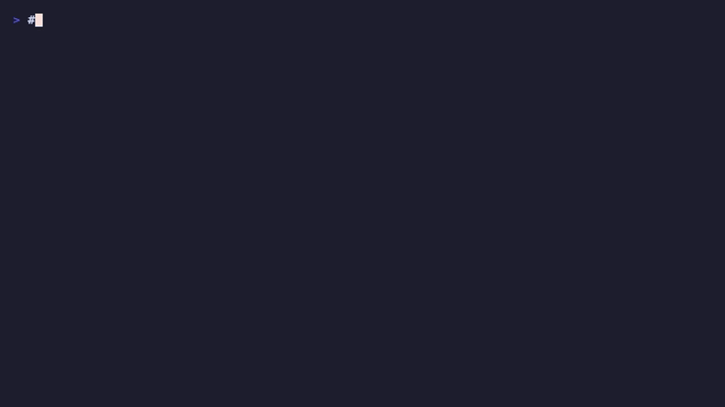

# Symphony Hub


> Central hub for monitoring and managing Symphony autonomous agents. Watch agents work in real-time with multi-pane dashboards, Linear integration, and detailed progress tracking.

## What Is This?

**Symphony Hub** is your command center for Symphony's autonomous agent system. It provides powerful monitoring tools and workflows to watch Symphony agents work in real-time as they autonomously complete tasks from Linear issues.

**What you can do:**
- 🎬 Launch agents from Linear issues
- 👀 Monitor agents in real-time with multi-pane dashboards
- 📊 Track Linear issue progress (state, comments, PRs)
- 🔍 Watch git activity, file changes, and events
- 🌐 View agent work in Phoenix web dashboard
- 🖼️ Feed visual mockups to agents (multimodal vision)
- 🖥️ Use the Go TUI dashboard for terminal-native monitoring

## Ecosystem

| Repo | Role | Link |
|------|------|------|
| **symphony-hub** (this repo) | Operator interface: TUI, scripts, workflows | — |
| **open-ai-symphony** | Core engine: orchestrator, dashboard, Codex client | [stussysenik/symphony](https://github.com/stussysenik/symphony) |
| **mymind-clone-web** | Product repo where agent PRs land | [stussysenik/mymind-clone-web](https://github.com/stussysenik/mymind-clone-web) |

See **[OPERATIONS.md](OPERATIONS.md)** for the full operator workflow, lifecycle diagram, and CLI reference.
If you are resuming work, start with `./launch.sh brief`.

## What's Included

### Custom-Built Monitoring Tools
These are **new scripts** created specifically for this demo:

| Script | Purpose |
|--------|---------|
| `demo.sh` | 🚀 Interactive launcher with menu |
| `watch-demo.sh` | 📺 4-pane tmux monitoring dashboard |
| `watch-workspace.sh` | 📂 Git/file change monitor |
| `watch-events.sh` | ⚡ Event highlighter for logs |
| `watch-linear.sh` | 📋 Linear issue status monitor |
| `linear-audit.sh` | 🧹 Queue hygiene audit across configured Linear projects |
| `linear-intake.sh` | 📝 Draft a structured Linear intake issue from a raw prompt |
| `linear-issuefmt.sh` | 🧾 Canonical formatter and `Todo`-readiness linter for Linear issue bodies |
| `linear-diagnose.sh` | 🔎 Diagnose an existing Linear issue against current repo state |
| `linear-archive.sh` | 🗃️ Archive stale issues with a preserved audit note |
| `workspace-recovery.sh` | 🧰 Inspect preserved workspaces before revive/archive decisions |
| `checkpoint.sh` | 💾 Local checkpoint snapshot for resumable handoffs |

### Linear Intake Helper

| Script | Purpose |
|--------|---------|
| `linear-new.sh` | 🧭 Open a pre-filled Linear issue composer with team/status/labels defaults |

### From Symphony (Existing)
These files are part of the Symphony system:

- `launch.sh` - Symphony's multi-instance launcher
- `config.sh` - Shared config helpers used by launch/monitor scripts
- `projects.yml` - Project configuration (repo roots, workspace strategy, Linear slugs)
- `generate-workflows.sh` - Workflow generator from config + template
- `checkpoint.sh` - Snapshot current hub/engine/runtime state for continuation
- `logs/` - Agent logs (generated at runtime)
- `pids/` - Process IDs (generated at runtime)
- `workspaces/` - Agent work directories (generated at runtime)

### Legacy Runtime Evidence

`symphony-setup` is still useful, but not as the canonical repo.

Use `/Users/s3nik/Desktop/symphony-setup` as:
- a preserved runtime workspace root from older runs
- a log/evidence locker for stale issues
- a recovery source when Linear tickets need to be archived or superseded without losing context

Use `symphony-hub` as the place where operator code, docs, OpenSpec changes, and release flow live.

### Go TUI Dashboard
Terminal-native monitoring built with Go + Charm (bubbletea, bubbles, lipgloss):

| Feature | Description |
|---------|-------------|
| Issues pane | Linear issues with state, cursor navigation |
| Agents pane | Active agent status, color-coded |
| Events pane | Scrollable event stream from logs |
| Project switcher | Switch between configured projects |
| Auto-refresh | 5s Linear API, 2s log polling |

```bash
# Build and run
cd tui && make build
./launch.sh tui

# Or start everything + TUI
./launch.sh start --tui
```

### Vision: Multimodal Agent Input
Agents can SEE mockups and screenshots attached to Linear issues:
- Automatic collection of image attachments from Linear
- Scans project `design/` and `assets/` directories
- Multimodal prompts with text + images sent to Codex
- Screenshot comparison tool for implementation verification
- Optional Figma MCP integration for design tokens

See `docs/VISION.md` for the full guide.

### Documentation
- `README.md` - This file (project overview)
- `SETUP.md` - Detailed setup instructions
- `docs/README.md` - Canonical doc map and daily operator entrypoint
- `LINEAR-GOLDEN-RULE.md` - **START HERE** - Minimal quick-start guide
- `LINEAR-INTAKE.md` - Recommended intake setup for Triage + templates
- `LINEAR-WORKFLOW.md` - Complete Linear integration guide
- `MONITORING-README.md` - Monitoring tools reference
- `DASHBOARD-GUIDE.md` - Phoenix dashboard usage
- `issue-signature.yml` - Canonical issue signature and `Todo` gate
- `issue_signature.py` - Shared formatter/evaluator used by intake, audit, diagnose, and issuefmt
- `docs/CHECKPOINTS.md` - Local snapshot and handoff workflow
- `docs/RESEARCH.md` - What we learned from Symphony
- `docs/DECISIONS.md` - Why we built Hub this way
- `docs/ARCHITECTURE.md` - How Hub is structured
- `docs/VISION.md` - Visual assets guide
- `openspec/` - Proposal, design, spec, and task artifacts for hub changes
- `CHANGELOG.md` - Generated release history

---

## Quick Start (5 Minutes)

### Prerequisites
- macOS or Linux
- Symphony installed and configured
- Linear account with API access

### Setup Steps

```bash
# 1. Clone this repository
git clone https://github.com/stussysenik/symphony-hub.git
cd symphony-hub

# 2. Install dependencies (macOS)
brew install tmux watch

# 3. Configure Linear API key
cp .env.local.example .env.local
# Edit .env.local and add your Linear API key from https://linear.app/settings/api

# 4. Launch the demo
./demo.sh
```

### That's It!
The demo will:
1. Open Phoenix web dashboard at http://localhost:4001
2. Show monitoring options
3. Ready to monitor agents when you create Linear issues

## Daily Operator Start

Use `symphony-hub` as the operator home going forward.

```bash
./launch.sh brief
./launch.sh intake --project mymind-clone-web --prompt "Polish search shell focus state across desktop and mobile"
./launch.sh start mymind-clone-web
```

`brief` is the default startup/resume surface. It shows:
- health
- active instances
- topology
- latest checkpoint summary
- Linear queue hygiene

Use `issuefmt` when you want the hub to canonicalize an issue body before it
becomes execution work:

```bash
./launch.sh issuefmt --project mymind-clone-web --issue CRE-123
```

## Which Command Do I Use?

Use the smallest command that matches the operator problem:

| Situation | Command | Why |
|------|------|------|
| You only have a raw NLP request | `./launch.sh intake --project <repo> --prompt "..."` | Drafts a repo-backed intake issue from scratch |
| The issue already exists, but you need to know whether it is stale, implemented, or re-queueable | `./launch.sh diagnose --project <repo> --issue <ID>` | Diagnoses the existing issue against current `main` |
| The issue exists but the body is structurally weak or inconsistent | `./launch.sh issuefmt --project <repo> --issue <ID>` | Canonicalizes the issue body and checks the `Todo` gate |
| You want the canonical body written back to Linear | `./launch.sh issuefmt --project <repo> --issue <ID> --apply` | Rewrites the issue description in-place without deleting extra sections |
| You want the diagnosis comment and safe state change written back to Linear | `./launch.sh diagnose --project <repo> --issue <ID> --apply` | Writes the `Diagnosis Review` comment and state update |
| You want a queue snapshot before starting work | `./launch.sh brief` or `./launch.sh audit` | Shows health, topology, checkpoint, and queue hygiene |
| You need to inspect abandoned local-only work | `./launch.sh recover --project <repo> --root /Users/s3nik/Desktop/symphony-setup/workspaces` | Recovers preserved runtime evidence without reviving bad queue state |

Operator rule:
- `intake` is for creating or refreshing understanding from raw language.
- `issuefmt` is for structure.
- `diagnose` is for deciding whether the issue still deserves execution.
- `Todo` is the execution gate, not the intake inbox.

## Dry-Run vs Apply

Most hub commands are preview-first by default.

| Command | Default | `--apply` behavior |
|------|------|------|
| `./launch.sh intake` | Writes a local intake bundle only | Creates or refreshes the Linear issue |
| `./launch.sh issuefmt` | Formats/lints and shows the canonical body | Rewrites the Linear issue description in-place |
| `./launch.sh diagnose` | Writes a local diagnosis bundle only | Adds a `Diagnosis Review` comment and applies the safe state change |
| `./launch.sh recover` | Inspects preserved runtime evidence only | No Linear mutation path |

If you want zero Linear mutation, stay in default mode or use `issuefmt` on a
local file/stdin:

```bash
printf '## Context\n...\n' | ./linear-issuefmt.sh --json
./linear-issuefmt.sh --body-file ./draft.md --check
```

## Common Operator Scenarios

### `audit` says `todo-unready-signature`

The issue should not stay in `Todo`.

1. Run `./launch.sh issuefmt --project <repo> --issue <ID>`.
2. If the body is still missing real content, keep it in `Backlog` or `Triage`.
3. Only move it back to `Todo` after the signature is clean.

### `audit` says `todo-needs-format`

The issue is substantively okay, but the body has drifted from canonical order.

1. Run `./launch.sh issuefmt --project <repo> --issue <ID> --apply`.
2. Re-run `issuefmt` or `audit`.
3. Leave it in `Todo` only if the content still reflects current `main`.

### `issuefmt` says ready, but `diagnose` says `implemented_on_main` or `rewrite_in_backlog`

`diagnose` wins the queue decision.

Why:
- `issuefmt` only answers structural readiness
- `diagnose` answers whether the issue is still relevant against current `main`

So:
- if `diagnose` says `implemented_on_main`, keep it out of execution and decide whether to archive or supersede it
- if `diagnose` says `rewrite_in_backlog`, keep it out of `Todo` even if the body is well-structured
- move to `Todo` only when both the signature is clean and the diagnosis still says the work deserves execution

### Existing issue is real, but structurally bad

Use this sequence:

1. `./launch.sh diagnose --project <repo> --issue <ID>`
2. `./launch.sh issuefmt --project <repo> --issue <ID> --apply`
3. Rewrite the placeholders into real content
4. Move to `Todo` only after the issue still looks relevant on current `main`

### No `Triage` state on the Linear team

The hub falls back to `Backlog`.

That is intentional. `Backlog` is the non-executing intake state until the team
actually exposes `Triage`.

### Diagnosis says the repo is dirty or behind `origin/main`

Do not execute from the canonical repo root.

The rule is:
- preserve the dirty repo root
- treat it as evidence, not the execution workspace
- let Symphony implement in a fresh per-issue worktree from current `origin/main`

## Multi-Repo Initiatives

Symphony now solves the general control-loop problem for any repo you have
explicitly configured in [`projects.yml`](projects.yml):

- intake
- issue formatting and readiness
- diagnosis
- execution
- review
- recovery

What it does not yet solve automatically is org-wide repo discovery and fan-out
from one sentence across arbitrary GitHub repos. For that, the right pattern is
still explicit configuration plus generated child issues.

The general problem is therefore mostly solved at the control-plane level for
managed repos:
- reproducible intake
- canonical issue structure
- repo-backed diagnosis
- execution and review loop
- evidence preservation

The unsolved part is automatic portfolio discovery and autonomous rollout
planning across repos you have not yet modeled in the hub.

### Example: Adopt Nix Across All Repos

Treat this as one initiative with many repo-local execution issues.

1. Add each target repo to [`projects.yml`](projects.yml) if it is not already managed by the hub.
2. Create one non-executing umbrella issue in Linear such as `Adopt Nix development shells across managed repos`.
3. Create one child issue per repo, for example:
   - `mymind-clone-web: add flake/devShell and document local usage`
   - `v0-ipod: add flake/devShell and verify existing scripts inside nix shell`
   - `recap: add flake/devShell and CI validation`
4. For each repo issue, use the same structure:
   - `Context`: current runtime/tooling state
   - `Problem`: why the repo is not reproducible today
   - `Desired Outcome`: what a successful Nix setup means for that repo
   - `Acceptance Criteria`: `nix develop` works, core commands work, docs exist, CI or validation passes
   - `Validation`: exact commands to run inside the dev shell
5. Run `intake` or `issuefmt` on each child issue, keep them in `Backlog` or `Triage`, and only move a small batch to `Todo`.
6. Use `diagnose` on stale child issues if the repo evolves underneath the campaign.

That is the clean portfolio pattern:
- one umbrella initiative for coordination
- one issue per repo for execution
- repo-specific validation, not one vague cross-repo mega-ticket

For a Nix rollout specifically, the per-repo acceptance bar should usually be:
- `nix develop` starts successfully
- the repo’s normal dev/test/build commands work inside the shell
- any required package managers or language runtimes are pinned
- README/setup docs explain the new path
- CI or a local verification command proves the shell still works later

The exact same pattern applies to:
- CodeRabbit adoption
- security baseline audits
- CI standardization
- release process normalization
- shared lint/test/runtime policy changes

---

## How It Works

### Starting Agents from Linear

Symphony watches your Linear project for new issues. To start an agent:

1. **Capture the issue in Linear**
   - Recommended: create it in `Triage` from a template and let Linear help route it
   - Faster intake path: use `./launch.sh intake --project ... --prompt "..."` to draft a `Triage` issue from a raw request plus repo diagnosis
   - Existing issue diagnosis path: use `./launch.sh diagnose --project ... --issue CRE-123` to investigate an existing issue against current repo state, then add `--apply` to write the diagnosis comment and safe state change
   - Canonical formatting path: use `./launch.sh issuefmt --project ... --issue CRE-123` to normalize the issue body into the required signature before promoting it
   - If the team does not expose `Triage`, the intake helper falls back to `Backlog` instead of creating executable work
   - Fast path: create it directly in `Todo` only if it already passes the issue signature gate
2. **Move the issue to `Todo`** only after the signature gate is clean
3. **Symphony detects it** (polls every few seconds)
4. **Agent starts automatically** - Creates a per-issue workspace checkout using the configured strategy (`clone` or `worktree`), then begins work

### Monitoring Agent Progress

#### In Linear
Watch your Linear issue for real-time updates:

- **Issue State** - Shows progress:
  - `Triage` → Intake inbox, not ready for agent execution yet
  - `Todo` → Agent hasn't started yet
  - `In Progress` → Agent actively working
  - `Human Review` → Agent finished, PR ready
  - `Done` → PR merged

- **Workpad Comments** - Detailed agent updates:
  - Task breakdown and plan
  - Progress updates
  - Environment info
  - Blockers

- **Attachments** - PR links:
  - Agent attaches PR URL when complete
  - Click to review code changes

#### In Terminal
Use monitoring scripts to watch in real-time:

```bash
# Launch full dashboard (4 panes: events, workspace, logs, Linear)
./watch-demo.sh

# Or monitor individually:
./launch.sh brief                # Startup/resume summary
./watch-linear.sh CRE-5          # Watch specific Linear issue
./linear-audit.sh                # Audit queues, stale issues, and review gaps
./launch.sh intake --project mymind-clone-web --prompt "Investigate search shell focus polish"
./launch.sh diagnose --project mymind-clone-web --issue CRE-123
./launch.sh issuefmt --project mymind-clone-web --issue CRE-123
./linear-archive.sh --issue CRE-8 --workspace-root /Users/s3nik/Desktop/symphony-setup/workspaces/mymind-clone-web
./workspace-recovery.sh --project mymind-clone-web --root /Users/s3nik/Desktop/symphony-setup/workspaces
./launch.sh sources              # Print hub/engine/project topology
./launch.sh checkpoint pre-review
./watch-workspace.sh v0-ipod     # Watch the latest workspace for a project
./watch-workspace.sh v0-ipod CRE-5
./watch-events.sh v0-ipod        # Watch agent events
```

#### In Web Dashboard
View Phoenix dashboard at http://localhost:4001:

- Live agent status
- Task progress
- System metrics
- Event logs

See `DASHBOARD-GUIDE.md` for detailed dashboard usage.

---

## Repository Structure

```
symphony-hub/
├── Scripts (Monitoring Tools)
│   ├── demo.sh              # Interactive launcher
│   ├── watch-demo.sh        # tmux multi-pane dashboard
│   ├── watch-workspace.sh   # Git monitor
│   ├── watch-events.sh      # Event highlighter
│   ├── watch-linear.sh      # Linear status monitor
│   ├── linear-audit.sh      # Queue hygiene report
│   └── linear-new.sh        # Pre-filled Linear issue composer launcher
│
├── Symphony Core
│   ├── launch.sh            # Multi-instance launcher (+ --tui, health)
│   └── projects.yml         # Project configuration (+ repo roots, worktrees, assets)
│
├── tui/                     # Go TUI Dashboard
│   ├── main.go              # Entry point
│   ├── model.go             # Bubbletea Model
│   ├── update.go            # Message handling
│   ├── view.go              # Rendering
│   ├── theme.go             # Color palette
│   ├── help.go              # Help overlay
│   ├── Makefile             # Build targets
│   ├── components/          # Pane sub-models
│   ├── linear/              # Linear API client
│   └── parser/              # Log file parser
│
├── docs/                    # Research & Architecture
│   ├── RESEARCH.md          # What we learned
│   ├── DECISIONS.md         # Why we built it this way
│   ├── ARCHITECTURE.md      # How it's structured
│   └── VISION.md            # Visual assets guide
│
├── Documentation
│   ├── README.md            # This file
│   ├── SETUP.md             # Setup instructions
│   ├── LINEAR-GOLDEN-RULE.md # Quick-start guide
│   ├── LINEAR-INTAKE.md     # Intake setup for Triage + templates
│   ├── LINEAR-WORKFLOW.md   # Linear integration guide
│   ├── MONITORING-README.md # Monitoring tools reference
│   └── docs/README.md       # Canonical doc map
│
├── Change Management
│   ├── openspec/            # Proposal/design/spec/task artifacts
│   └── .codex/              # OpenSpec prompts + Codex skills
│
├── Release
│   ├── package.json         # semantic-release toolchain
│   ├── release.config.cjs   # Release channels and plugins
│   ├── CHANGELOG.md         # Generated changelog
│   └── .github/workflows/   # GitHub release workflow
│
├── Legacy Runtime
│   └── /Users/s3nik/Desktop/symphony-setup
│       # Preserved workspaces/logs for recovery and audit
│
├── Configuration
│   ├── .env.local.example   # Template (committed)
│   ├── .env.local           # Your config (NOT committed)
│   └── figma-mcp.json       # Figma MCP server config
│
├── Linear Intake Templates
│   └── linear-templates/    # Copy-ready template blueprints for Linear
│
├── Workflow Appendices
│   └── workflow-instructions/ # Optional per-project workflow addenda
│
└── Runtime (Git Ignored)
    ├── logs/                # Symphony logs
    ├── pids/                # Process IDs
    └── workspaces/          # Agent workspaces
```

---

## Documentation

- **[LINEAR-GOLDEN-RULE.md](LINEAR-GOLDEN-RULE.md)** - **START HERE** - Minimal quick-start guide
- **[LINEAR-INTAKE.md](LINEAR-INTAKE.md)** - Recommended Triage + templates setup
- **[SETUP.md](SETUP.md)** - Detailed setup and installation guide
- **[LINEAR-WORKFLOW.md](LINEAR-WORKFLOW.md)** - Complete Linear integration workflow
- **[MONITORING-README.md](MONITORING-README.md)** - Monitoring tools reference
- **[DASHBOARD-GUIDE.md](DASHBOARD-GUIDE.md)** - Phoenix dashboard guide

---

## Usage Examples

### Example 1: Watch a Specific Agent

```bash
# Create Linear issue "Add new feature" (gets ID CRE-5)
# Move it to Todo if it started in Triage
# Symphony starts agent automatically

# Monitor in real-time
./watch-linear.sh CRE-5
```

### Example 2: Full Dashboard

```bash
# Launch 4-pane monitoring dashboard
./watch-demo.sh

# You'll see:
# - Top left: Agent events (highlighted)
# - Top right: Workspace changes (git activity)
# - Bottom left: Raw logs
# - Bottom right: Linear issue status
```

### Example 3: Interactive Menu

```bash
# Launch with menu
./demo.sh

# Options:
# 1. Open Phoenix Dashboard
# 2. Watch Full Demo (tmux)
# 3. Monitor Workspace
# 4. Watch Events
# 5. Monitor Linear Issue
# 6. View Logs
# 7. Agent Status
```

---

## What Makes This Reusable

✅ **Config-driven paths** - Runtime roots and local repo paths live in `projects.yml`
✅ **Configuration template** - `.env.local.example` for easy setup
✅ **Clear documentation** - Step-by-step guides
✅ **Dependency checks** - Scripts verify tmux, watch, python3
✅ **Protected secrets** - API keys never committed
✅ **Portable** - Works on any macOS/Linux system

Anyone can:
1. Clone this repo
2. Add their Linear API key
3. Run `./demo.sh`
4. Start monitoring their Symphony agents

---

## Troubleshooting

### Scripts not executable
```bash
chmod +x *.sh
```

### tmux not found
```bash
# macOS
brew install tmux

# Linux (Ubuntu/Debian)
sudo apt-get install tmux
```

### watch command not found
```bash
# macOS
brew install watch

# Linux (Ubuntu/Debian)
sudo apt-get install procps
```

### Phoenix dashboard not loading
```bash
# Check if Symphony is running
./launch.sh status

# Start Symphony if needed
./launch.sh start all
```

### Linear API key issues
1. Verify key is in `.env.local`
2. Get new key from https://linear.app/settings/api
3. Check key has correct permissions

---

## Security Notes

⚠️ **IMPORTANT:** This repository uses `.gitignore` to protect your secrets:

- `.env.local` is **NEVER committed** to Git
- Always use `.env.local.example` as a template
- Never share your Linear API key
- Keep this repository **private**

---

## Support & Feedback

For questions or issues:
- Check the documentation guides
- Review Symphony documentation
- Verify your Linear API key and permissions

---

## License

Symphony Hub is provided as-is for use with Symphony autonomous agents.

---

**Ready to watch agents work?** → `./demo.sh`
